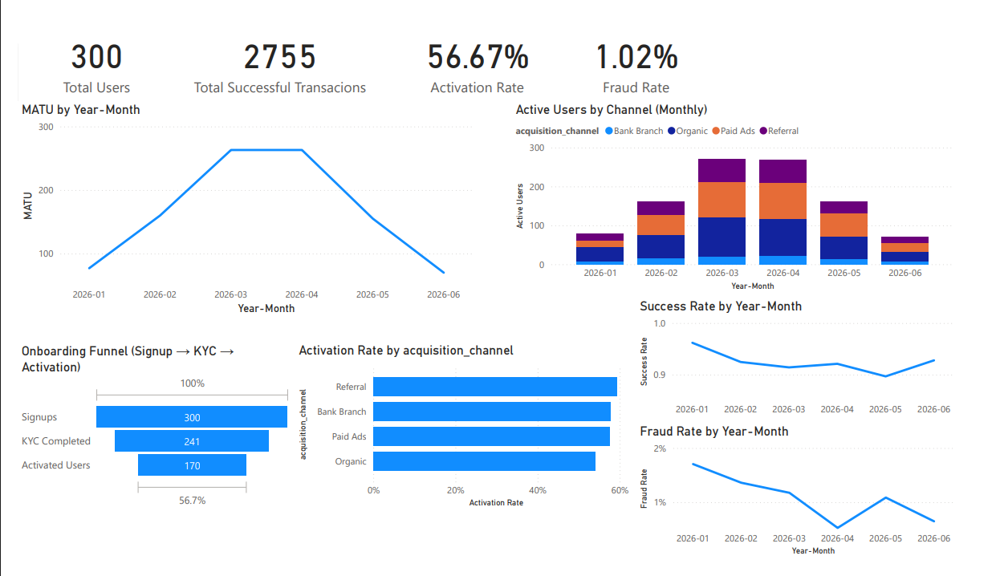
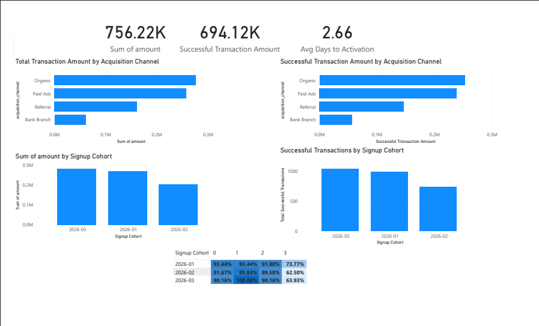

# Fintech Product Analytics Dashboard

This project analyzes the lifecycle of a fintech product using Power BI.

The dashboard explores user acquisition performance, onboarding funnel metrics,
cohort retention patterns, fraud monitoring, and transaction revenue analysis.

## Key Metrics
- Total Users
- Activation Rate
- Fraud Rate
- Monthly Active Transacting Users (MATU)
- Transaction Volume
- Cohort Retention
- Channel Performance

## Dashboard Pages

### Product Overview
Tracks overall product performance including:
- MATU growth trends
- Signup → KYC → Activation funnel
- Acquisition channel performance
- Fraud and transaction success rates

### Revenue & Cohort Analysis
Analyzes monetization and retention patterns:
- Transaction revenue by acquisition channel
- Successful transactions by cohort
- Cohort retention matrix
- Average time to activation

## Tools Used
Power BI  
DAX  
Cohort Analysis  
Product Funnel Analysis  
Data Visualization

## Dashboard Preview

### Product Overview

### Revenue & Cohort Analysis

## Analytical Insights

### Acquisition Channel Performance
Organic and Paid Ads generated the highest overall transaction value, indicating strong acquisition scale through these channels. However, Referral users demonstrated stronger activation behaviour relative to their cohort size, suggesting higher initial engagement and user quality.

### Onboarding Funnel Stability
The signup → KYC → activation funnel showed relatively consistent conversion across cohorts, indicating that onboarding friction was not a major barrier to activation. This suggests that the product’s onboarding flow was functioning effectively.

### Cohort Retention Behaviour
Cohort analysis revealed that user engagement gradually declined across later months since signup. This pattern is typical in digital products and highlights the importance of retention strategies such as feature engagement, incentives, or lifecycle messaging.

### Transaction Revenue Patterns
Successful transaction amounts were strongly correlated with acquisition channels that generated larger user bases. This indicates that acquisition scale still plays a major role in overall revenue contribution.

### Time to Activation
The average time to activation was approximately **2.66 days**, indicating that most users reached their first meaningful product interaction quickly after signup.

## Business Implications
The analysis suggests that improving **long-term retention and engagement** may provide greater impact than further optimizing onboarding. Additionally, strengthening referral programs could improve acquisition efficiency by attracting higher-quality users.
